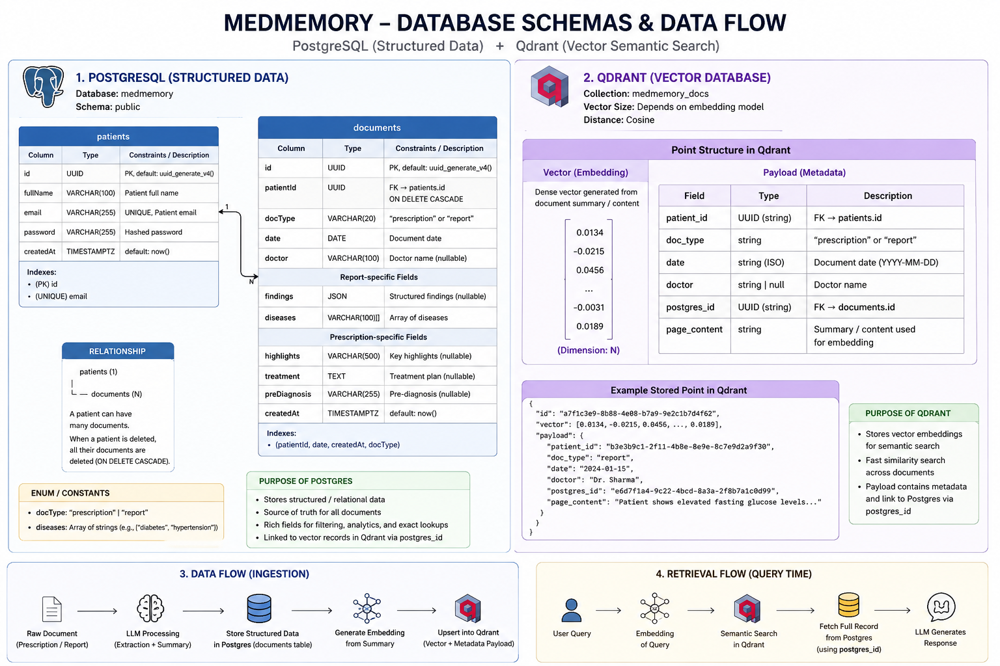

# 🗄️ Database & Vector Store Schema Design

MedMemory AI uses a hybrid storage architecture consisting of:

- **PostgreSQL** → Source of truth for structured patient records and chronological medical history.
- **Qdrant Vector Database** → Semantic memory layer for Retrieval-Augmented Generation (RAG) and contextual AI conversations.

This separation enables reliable timeline tracking while supporting intelligent semantic search across a patient's medical history.

---



---

# 🐘 1. Relational Database Layer (PostgreSQL)

The relational layer stores structured patient information extracted from prescriptions, reports, scans, and other medical documents.

---

## `patients` Table

Primary profile storage for each patient.

| Column Name | Data Type | Constraints | Description |
| :--- | :--- | :--- | :--- |
| `id` | `UUID` | `PRIMARY KEY` | Unique patient identifier. |
| `full_name` | `VARCHAR(100)` | `NOT NULL` | Full name of the patient. |
| `email` | `VARCHAR(255)` | `UNIQUE`, `NOT NULL` | Login email address. |
| `password` | `VARCHAR(255)` | `NOT NULL` | Secure password hash (bcrypt/argon2). |
| `created_at` | `TIMESTAMPTZ` | `DEFAULT NOW()` | Record creation timestamp. |

---

## `documents` Table

Unified storage for all uploaded medical documents.

Supported document types:

- Prescription
- Lab Report
- Diagnostic Report
- Scan Report

| Column Name | Data Type | Constraints | Description |
| :--- | :--- | :--- | :--- |
| `id` | `UUID` | `PRIMARY KEY` | Unique document identifier. |
| `patient_id` | `UUID` | `FOREIGN KEY` | References `patients(id)`. |
| `doc_type` | `VARCHAR(20)` | `NOT NULL` | Document category (`prescription`, `report`). |
| `date` | `DATE` | `NOT NULL` | Date associated with the document. |
| `doctor` | `VARCHAR(100)` | `NULLABLE` | Doctor or clinician name. |
| `findings` | `JSONB` | `NULLABLE` | Structured report findings or extracted values. |
| `diseases` | `TEXT[]` | `NULLABLE` | Diseases identified within the document. |
| `highlights` | `VARCHAR(500)` | `NULLABLE` | Symptoms, complaints, observations, or summary notes. |
| `treatment` | `TEXT` | `NULLABLE` | Prescribed medications, dosage information, and treatment instructions. |
| `pre_diagnosis` | `VARCHAR(255)` | `NULLABLE` | Preliminary diagnosis or recommended investigations. |
| `created_at` | `TIMESTAMPTZ` | `DEFAULT NOW()` | Record creation timestamp. |

---

## Entity Relationship

```text
Patient
   │
   └───< Document
```

Each patient can own multiple medical documents.

Each document belongs to exactly one patient.

---

## 🌀 2. Dense Semantic Vector Layer (Qdrant)

The Qdrant index tracks unstructured contextual semantics. The payload fields are split into searchable content arrays and strict relational attributes used exclusively as high-speed query execution filters.

* **Collection Name:** `clinical_memories`
* **Vector Signature:** 1024 Dimensions (`mxbai-embed-large`)
* **Distance Metric:** Cosine Similarity

### Payload & Metadata Architecture

| Field Component | JSON Key Name | Data Type | Search Configuration | Description / Purpose |
| :--- | :--- | :--- | :--- | :--- |
| **Vector Input** | `page_content` | `TEXT` | **Embedded (Vectorized)** | LLM-generated concise clinical summaries combining `highlights`, `treatment`, `pre_diagnosis`, `findings`, and `diseases`. Used for dense semantic vector RAG search queries. |
| **Metadata Filter**| `date` | `STRING` (ISO) | **Indexed (No Embedding)** | The exact calendar date of the clinical event. Used for chronological time-window pre-filtering. |
| **Metadata Filter**| `doctor` | `STRING` | **Indexed (No Embedding)** | Name of the treating clinician. Used to isolate records from specific provider names. |
| **Metadata Filter**| `postgres_id` | `STRING` | **Indexed (No Embedding)** | Relational anchor string `patient_id`. Ensures absolute multi-tenant privacy separation inside the shared vector collection. |
| **Metadata Filter**| `doc_type` | `STRING` | **Indexed (No Embedding)** | Explicit tracking tag indicating parent source provenance (`"prescription"` vs. `"report"`). |

---

# 📌 Design Rationale

This architecture provides:

✅ Fast chronological queries via PostgreSQL

✅ Semantic search via Qdrant

✅ Traceability from vector memory to source document

✅ RAG-friendly retrieval architecture

✅ Scalable patient-specific filtering

✅ Simple MVP implementation with room for future expansion
