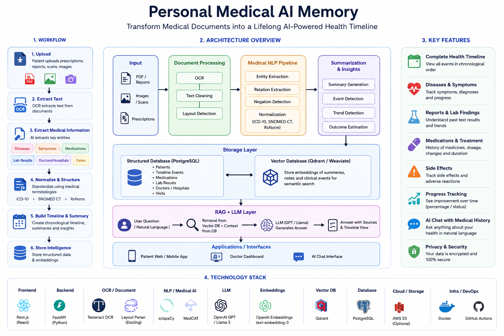
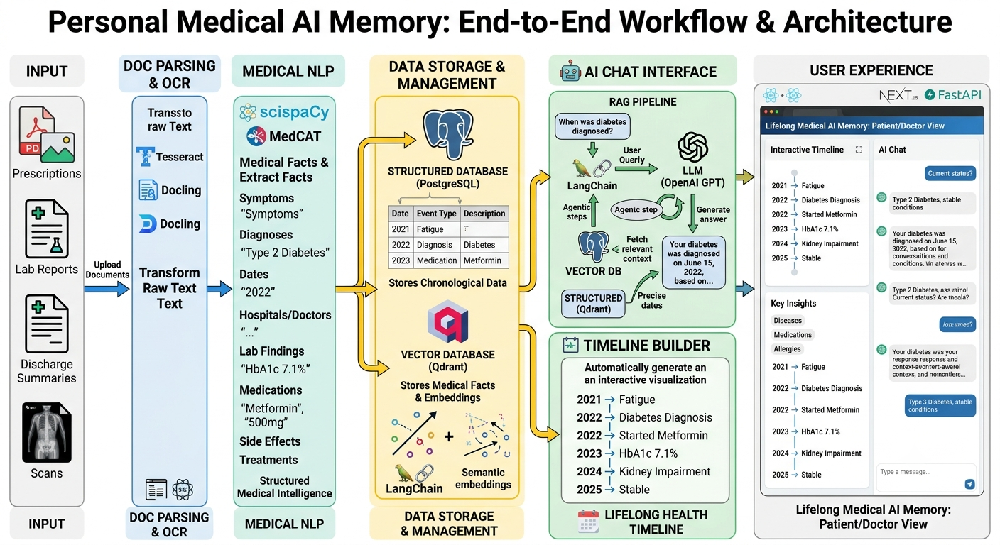

## ⚡ Core System & AI Architecture

The platform transforms medical documents into a lifelong, searchable health memory using a hybrid structured-data + GenAI architecture.

### Key Concepts

* **Document Intelligence:** Extracts text, layout, tables, and medical information from prescriptions, reports, scans, and discharge summaries using OCR and document parsing.

* **Medical NLP Pipeline:** Identifies diseases, symptoms, medications, dosages, lab tests, doctors, hospitals, and dates using medical-specific NLP models.

* **Timeline Generation Engine:** Converts fragmented medical records into a structured chronological patient health timeline.

* **Structured Medical Memory:** Stores normalized medical events, treatments, diagnoses, and laboratory results in PostgreSQL for accurate querying and analytics.

* **Semantic Search & Embeddings:** Converts medical summaries into vector embeddings and stores them in Qdrant for semantic retrieval across the patient's entire history.

* **Hybrid Retrieval Architecture:** Combines PostgreSQL (facts, timelines, medications, labs) with Qdrant (semantic medical memory) to retrieve the most relevant context.

* **Retrieval-Augmented Generation (RAG):** Grounds LLM responses using retrieved patient records to reduce hallucinations and improve medical answer accuracy.

* **AI Health Assistant:** Enables patients and doctors to chat with the complete medical history, generate summaries, track disease progression, analyze lab trends, and understand treatment journeys.

---

### Architecture Images

