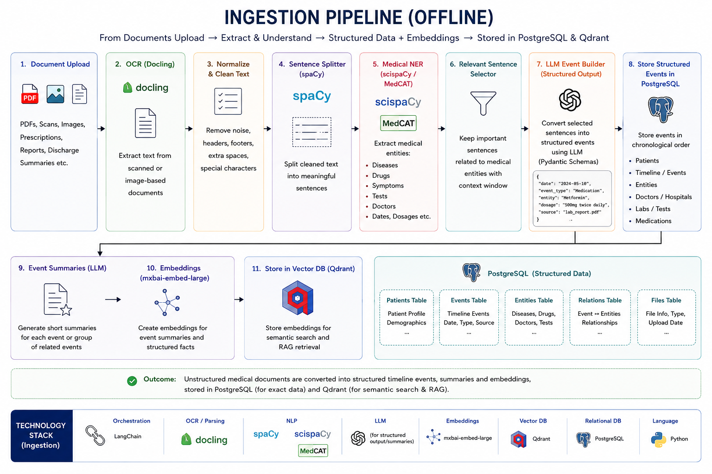
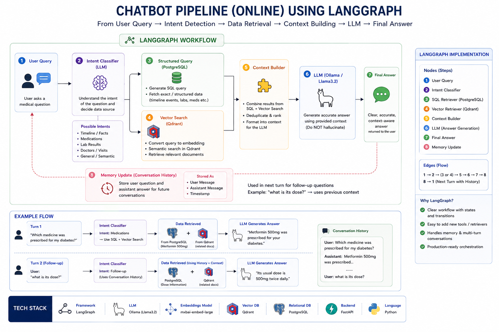

# ⚙️ Core System Workflows

MedMemory AI operates through two primary workflows:

1. **Document Ingestion Pipeline** — Converts medical documents into structured medical memory.
2. **Conversational RAG Pipeline** — Retrieves and synthesizes relevant patient history for AI-powered chat.

---

# 1. Document Ingestion Pipeline

This workflow transforms prescriptions, lab reports, discharge summaries, and clinical documents into structured medical records and semantic memory.

## Execution Sequence

### 1. Document Upload & OCR

Users upload:

- Prescriptions
- Lab Reports
- Scan Reports
- Discharge Summaries

Documents are processed using:

- `PyMuPDF` (PDF extraction)
- `Tesseract OCR` (images and scanned PDFs)

to obtain clean machine-readable text.

---

### 2. Text Cleaning & Normalization

Extracted text undergoes:

- OCR noise removal
- Whitespace normalization
- Header/Footer removal
- Basic formatting cleanup

to improve downstream extraction quality.

---

### 3. Medical Information Extraction

A local LLM analyzes the cleaned text and extracts clinically relevant information into a validated structured schema.

Examples:

- Doctor Name
- Hospital Name
- Diagnosis
- Symptoms
- Medications
- Dosage
- Findings
- Tests
- Recommendations
- Document Date

All outputs are validated using Pydantic models before storage.

---

### 4. Structured Document Construction

The extracted information is transformed into a normalized medical document object.

Example:

```json
{
  "doctor": "Dr. Sharma",
  "document_date": "2025-01-10",
  "diagnosis": ["Type 2 Diabetes"],
  "medications": ["Metformin 500mg"],
  "findings": ["HbA1c 9.2%"]
}
```

---

### 5. Hybrid Storage Layer

#### PostgreSQL

Stores structured medical records:

- Patient Profile
- Medical Documents
- Diagnoses
- Treatments
- Findings
- Timeline Metadata

PostgreSQL acts as the system's source of truth.

---

#### Qdrant

The document is summarized into a concise semantic representation.

Example:

```text
Type 2 Diabetes diagnosed.
Metformin initiated.
HbA1c elevated at 9.2%.
```

The summary is embedded using:

```text
mxbai-embed-large
```

and stored in Qdrant with metadata:

```json
{
  "patient_id": "...",
  "postgres_id": "...",
  "document_type": "...",
  "doctor": "...",
  "date": "..."
}
```

This enables semantic retrieval during conversations.

---

### Storage Outcome

```text
Medical Document
        ↓
OCR
        ↓
Structured Extraction
        ↓
 ┌──────────────┬──────────────┐
 │              │              │
PostgreSQL    Summary      Metadata
(Source)         ↓             ↓
                 Embedding
                     ↓
                 Qdrant
```



---

# 2. Conversational RAG Pipeline

This workflow enables users to chat with their complete medical history using retrieval-augmented generation (RAG).

---

## Execution Sequence

### 1. User Query

The user submits a question.

Examples:

```text
What medications am I currently taking?

When was diabetes diagnosed?

How has my treatment changed over time?
```

---

### 2. Intent Classification

A lightweight LLM router classifies the query into one of three categories:

#### Structured

Requires exact database records.

Examples:

```text
Show all medications.

Show my latest prescription.

List all doctors visited.
```

---

#### Semantic

Requires semantic understanding of historical context.

Examples:

```text
Summarize my heart-related issues.

What patterns do you see in my health history?
```

---

#### Hybrid

Requires both structured records and semantic context.

Examples:

```text
How has my diabetes treatment changed over time?

Compare my current treatment with previous treatments.
```

---

### 3. Retrieval Layer

#### Structured Path

The system directly retrieves relevant records from PostgreSQL.

Examples:

- Medications
- Diagnoses
- Timeline Events
- Reports

---

#### Semantic Path

The query is embedded and searched against Qdrant.

Retrieval is filtered by:

```text
patient_id
```

to ensure patient isolation.

---

#### Hybrid Path

The system:

```text
Query
    ↓
Qdrant Search
    ↓
Retrieve postgres_id metadata
    ↓
Fetch source records from PostgreSQL
```

This combines:

- Semantic relevance from Qdrant
- Structured accuracy from PostgreSQL

without requiring text-to-SQL generation.

---

### 4. Context Builder

Retrieved information is:

- Deduplicated
- Ranked
- Organized
- Compressed

into a clean context package.

Example:

```text
Diagnosis:
Type 2 Diabetes

Timeline:
Jan 2023 → Diagnosis
Feb 2023 → Metformin Started
Jul 2024 → Dosage Increased

Relevant Notes:
Patient showed improved glucose control.
```

---

### 5. Response Generation

The compiled context is passed to a local LLM through Ollama.

The model is instructed to:

- Answer only from provided context
- Avoid unsupported assumptions
- Cite relevant medical history when possible

This significantly reduces hallucinations.

---

### 6. Conversational Memory

LangGraph maintains conversation state including:

- Previous user questions
- Previous AI responses
- Active patient context

allowing the system to handle follow-up questions naturally.

Example:

```text
User:
When was diabetes diagnosed?

Assistant:
January 2023.

User:
Who prescribed the medication?

Assistant:
Dr. Sharma prescribed Metformin during the initial diagnosis visit.
```

---

### Retrieval Architecture

```text
User Query
      ↓
Intent Router
      ↓

 ┌────────────┬────────────┬────────────┐
 │Structured  │ Semantic   │  Hybrid    │
 └────────────┴────────────┴────────────┘

      ↓             ↓             ↓

 PostgreSQL      Qdrant      Qdrant
                               ↓
                         postgres_id
                               ↓
                          PostgreSQL

      ↓             ↓             ↓

        Context Builder
               ↓
          Ollama LLM
               ↓
          Final Answer
```


