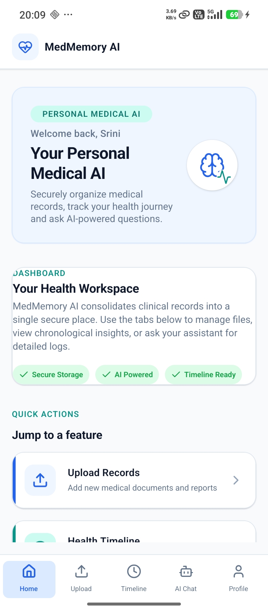
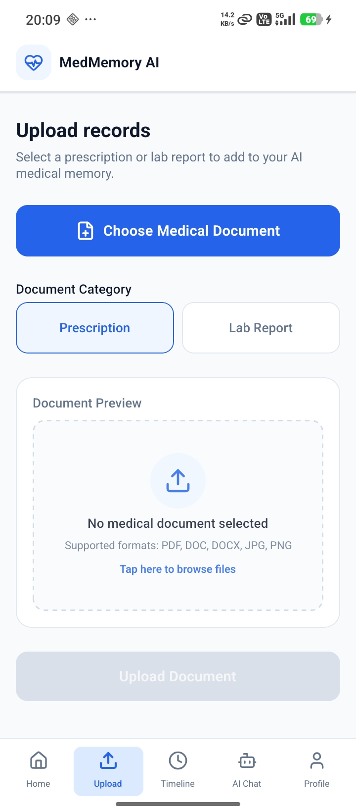
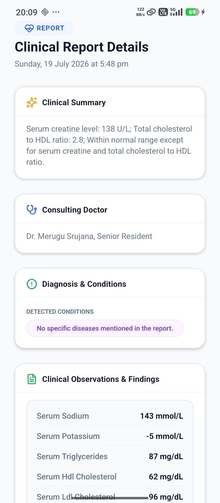
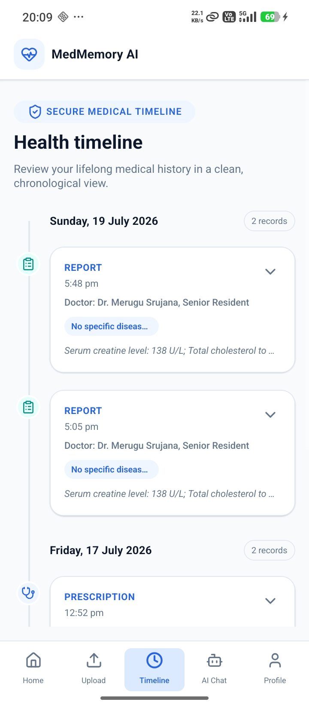
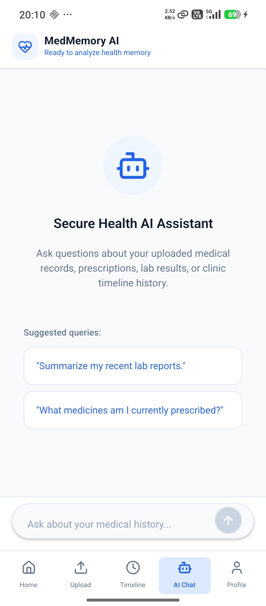
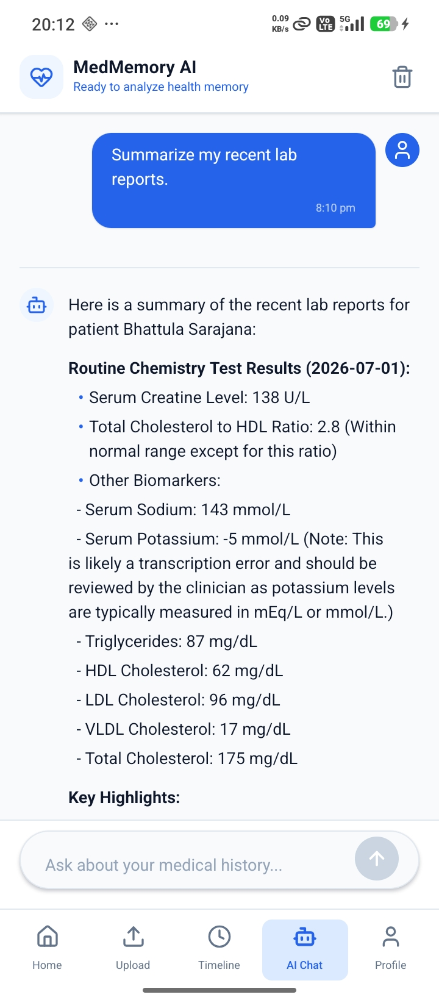
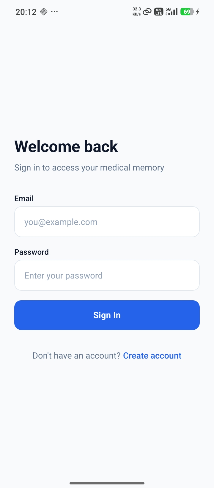
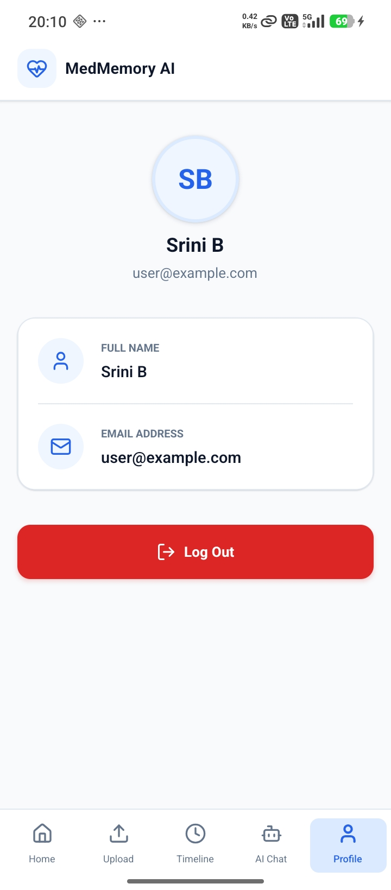

# 🕹️ How to Use

---

### 1. Upload Medical Records
Upload prescriptions, lab reports, discharge summaries, or other medical documents through the application.

---

### 2. Automatic Health Memory Generation
MedMemory processes your documents using OCR and AI to extract important medical information such as:

- Diagnoses
- Symptoms
- Medications
- Test Results
- Doctors & Hospitals
- Treatment History

The extracted information is then organized into your personal health memory.

---

### 3. Explore Your Health Timeline
View your medical history in a structured chronological timeline.

Track:

- Medical conditions
- Treatments
- Prescriptions
- Reports
- Healthcare visits

all in one place.

---

### 4. Chat With Your Medical History
Use the AI assistant to ask questions about your health records.

Example queries:

- *When was I diagnosed with diabetes?*
- *What medications have I taken for hypertension?*
- *Summarize my recent lab reports.*
- *How has my treatment changed over time?*

The AI retrieves relevant information from your health memory and generates contextual responses.

---

### 5. Continue Building Your Health Memory
Upload new medical documents anytime to keep your timeline and AI memory up to date.

